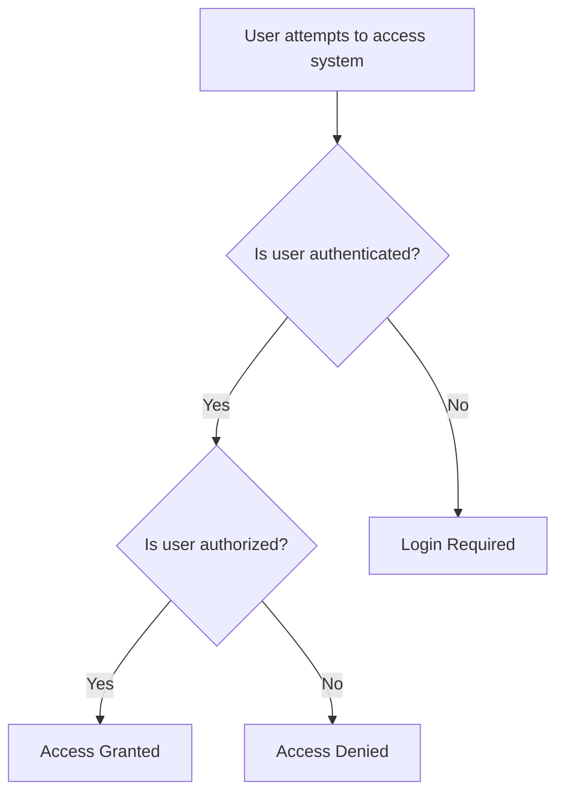
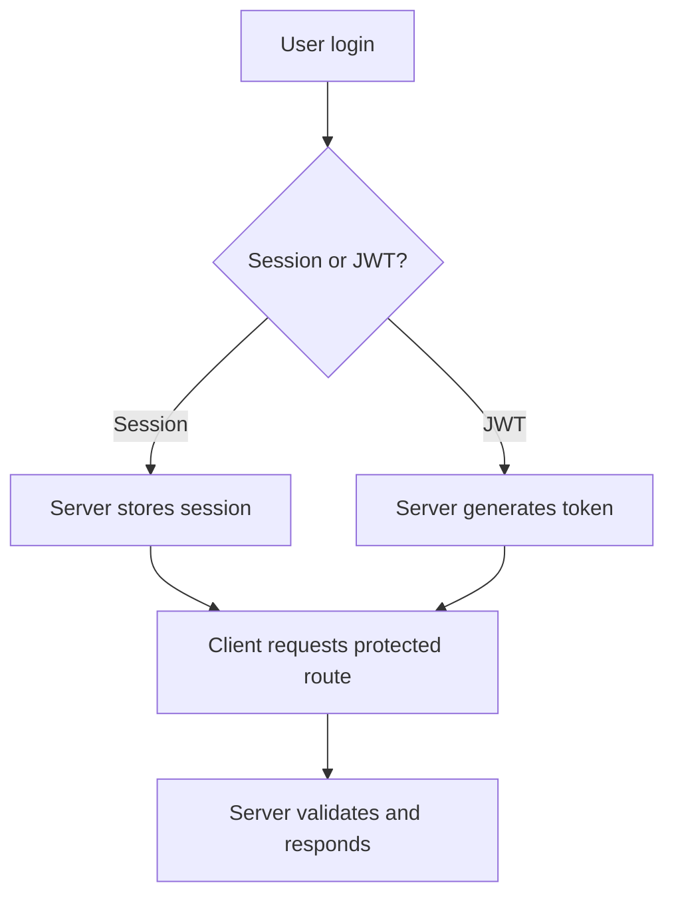
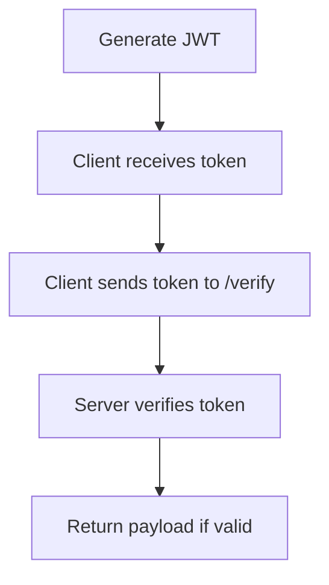
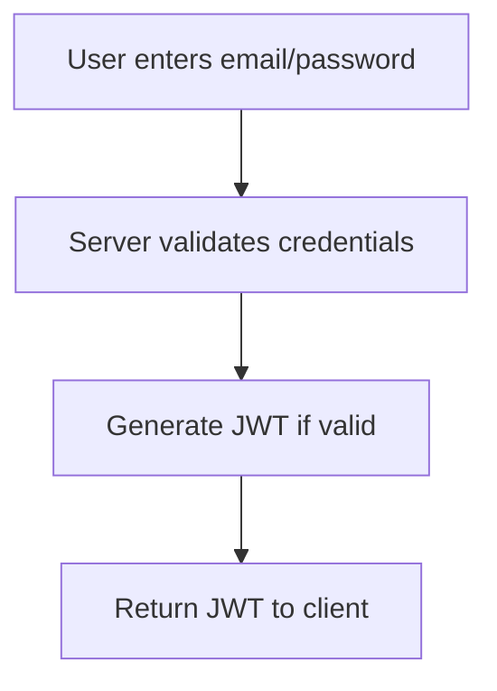
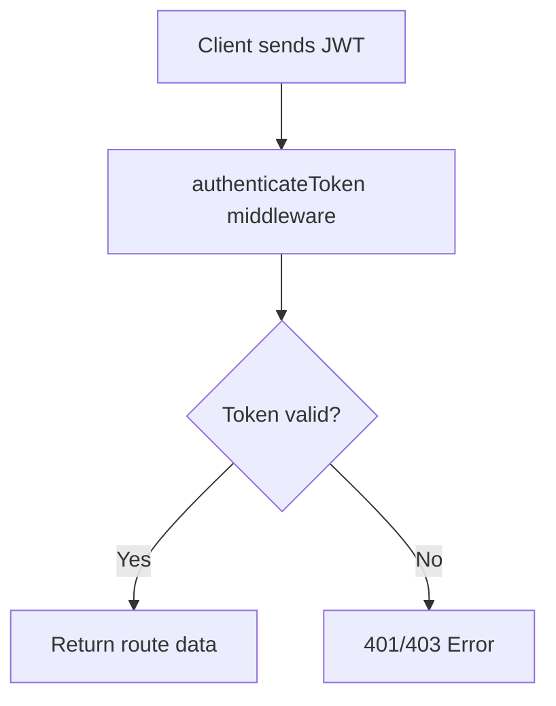
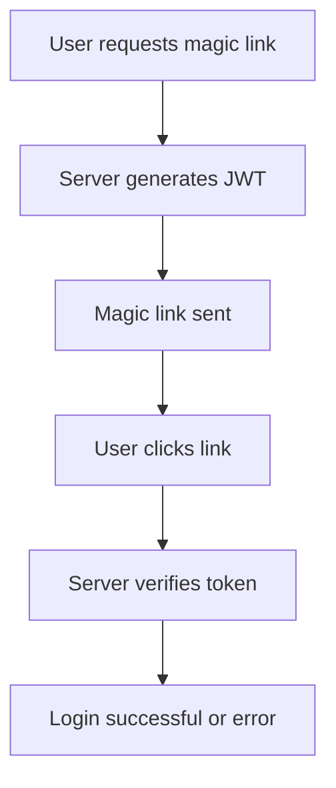
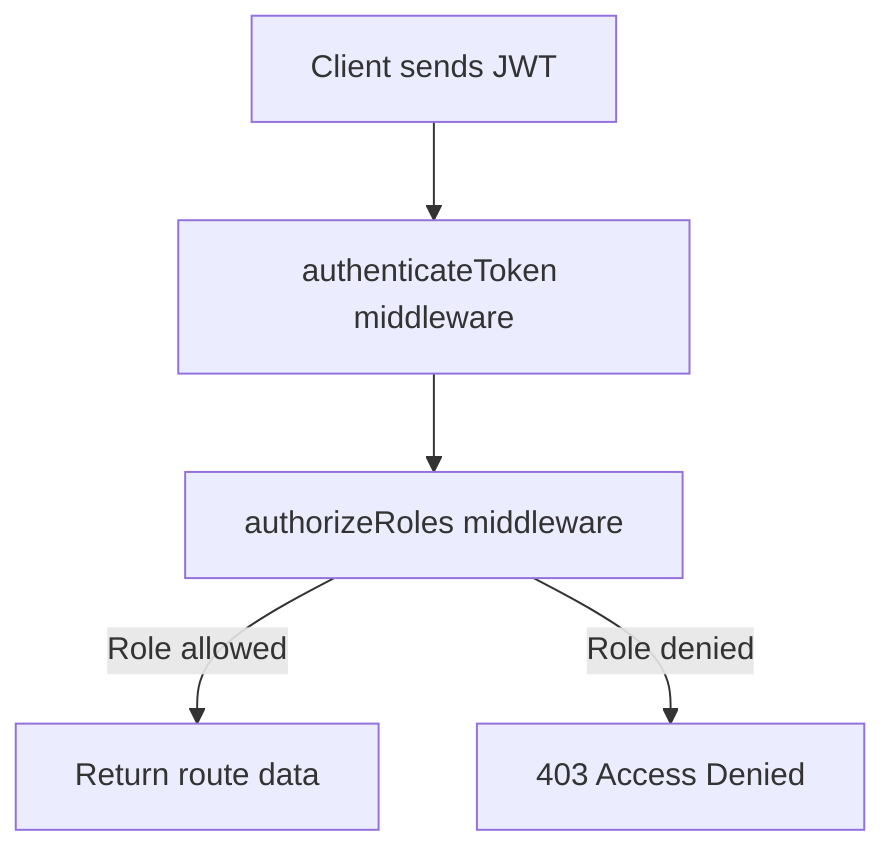
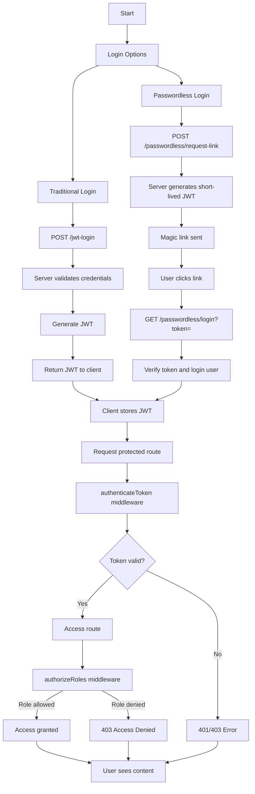

# Authentication & Authorization

## Introduction

This Folder demonstrates **Authentication & Authorization** using Node.js and Express.js with JWT (JSON Web Tokens). It covers multiple approaches including traditional login, passwordless authentication, session vs token, protected routes, and role-based access control (RBAC).

### Node Modules Required

* express
* express-session
* jsonwebtoken
* body-parser (optional, if not using express.json())
* dotenv (optional, for managing environment variables)

Install using:

```bash
npm install express express-session jsonwebtoken body-parser dotenv
```

### Why Authentication & Authorization?

* **Authentication**: Verifies the identity of the user.
* **Authorization**: Determines what actions an authenticated user can perform.

### Real-World Use Cases

* Web apps with dashboards where only logged-in users can access data.
* Admin panels where only users with certain roles can modify/delete data.
* Mobile apps that require token-based API access.
* Passwordless login flows like magic links or OTPs.

---

## Concepts Learned

1. Auth vs Authz
2. Session vs Token
3. JWT Basics
4. JWT Login
5. JWT Protected Routes
6. Passwordless Authentication
7. Role-Based Access Control (RBAC)

---

## 1. Auth vs Authz

**Concept Explanation:**

* **Authentication:** Confirms the user is who they say they are.
* **Authorization:** Grants or restricts access based on user roles or permissions.

**Code:** Conceptual, no file. This forms the base for all JWT flows.

**Testing in Postman:** N/A (conceptual)

**Flowchart:**



---

## 2. Session vs Token

**Concept Explanation:**

* Session-based: Server stores user session; client uses cookie.
* Token-based: Server issues JWT; client stores it; server remains stateless.
* Real-world: SPAs or mobile apps prefer JWT; traditional apps often use sessions.

**Code:** `session-vs-token.js`

```js
// Demonstrates session and JWT login
```

**Code Explanation:**

* Session: Express-session saves user info server-side.
* Token: JWT is issued to client, verified on each request.

**Testing in Postman:**

1. Session:

   * POST `/session-vs-token/login` with JSON body `{ "email": "user@mail.com", "password": "password" }`
   * Cookies stored automatically.
   * GET `/session-vs-token/protected` → returns 200 OK if session valid.
2. Token:

   * POST `/session-vs-token/login` → receive JWT in response.
   * GET `/session-vs-token/protected` with header `Authorization: Bearer <JWT>` → 200 OK.

**Expected Output:**

* Valid session/JWT: 200 OK
* Invalid session/JWT: 401 Unauthorized

**Flowchart:**



---

## 3. JWT Basics

**Concept Explanation:**

* JWT structure: Header, Payload, Signature.
* Signing ensures token integrity.
* Verification ensures token authenticity.

**Code:** `jwt-basics.js`

```js
router.get('/generate', (req, res) => {
  const token = sign({id:1, email:'user@mail.com', role:'user'}, '10m');
  res.json({ token });
});

router.get('/verify', (req, res) => {
  const decoded = verify(req.query.token);
  res.json({ decoded });
});
```

**Code Explanation:**

* `/generate` creates JWT with payload.
* `/verify` validates JWT and returns payload.

**Testing in Postman:**

* GET `/generate` → Returns `{ token: '<JWT>' }`
* GET `/verify?token=<JWT>` → Returns `{ id, email, role, iat, exp }`
* Invalid token → `{ message: 'Invalid token' }`

**Flowchart:**



---

## 4. JWT Login

**Concept Explanation:**

* Authenticate users via email/password.
* Generate JWT upon successful login.

**Code:** `jwt-login.js`

```js
router.post('/jwt-login', (req,res)=>{
  // validate user
  const token = sign({id:user.id,email:user.email,role:user.role},'1h');
  res.json({ message: 'Login successful', token });
});
```

**Code Explanation:**

* Validates credentials from DB.
* Generates JWT using utils/jwt.js.

**Testing in Postman:**

* POST `/jwt-login` with body `{ "email": "user@mail.com", "password": "password" }`
* Response: `{ message: 'Login successful', token: '<JWT>' }`
* Invalid credentials → 400 Error `{ message: 'Invalid credentials' }`

**Flowchart:**



---

## 5. JWT Protected Routes

**Concept Explanation:**

* Only authenticated users with valid JWT can access certain routes.

**Code:** `jwt-protected.js`

```js
router.get('/dashboard', authenticateToken, (req,res)=>{
  res.json({ message: 'Welcome to dashboard', user: req.user });
});
```

**Code Explanation:**

* Middleware `authenticateToken` verifies JWT.
* Route accessible only if JWT is valid.

**Testing in Postman:**

* GET `/jwt-protected/dashboard` with header `Authorization: Bearer <JWT>`
* Response valid: `{ message: 'Welcome...', user: {...} }`
* Missing/invalid token: 401/403 Error

**Flowchart:**



---

## 6. Passwordless Authentication

**Concept Explanation:**

* Login without password using magic link or OTP.
* Real-world: "Login via email link".

**Code:** `passwordless.js`

```js
router.post('/request-link',(req,res)=>{ /* generate short-lived JWT */ });
router.get('/login', (req,res)=>{ /* verify token */ });
```

**Testing in Postman:**

* POST `/passwordless/request-link` with body `{ "email": "user@mail.com" }` → Returns magic link
* GET `/passwordless/login?token=<JWT>` → Returns login success
* Invalid/expired token → 401 Error

**Flowchart:**



---

## 7. Role-Based Access Control (RBAC)

**Concept Explanation:**

* Restrict routes based on roles in JWT payload.
* Real-world: Admin dashboards, editor roles, multi-tier apps.

**Code:** `role-based.js`

```js
router.get('/admin-dashboard', authenticateToken, authorizeRoles('admin'), (req,res)=>{
  res.json({ message: 'Welcome admin', user: req.user });
});
```

**Testing in Postman:**

* Login as admin → get token
* GET `/role-based/admin-dashboard` with header `Authorization: Bearer <JWT>` → 200 OK
* Login as user → GET same route → 403 Access Denied

**Flowchart:**



---

## Complete Flowchart



## Conclusion

This folder provides a **complete JWT-based authentication and authorization system** including:

* Traditional login and passwordless login
* Token generation, verification, and storage
* Protected routes and role-based access
* Detailed testing scenarios using Postman

